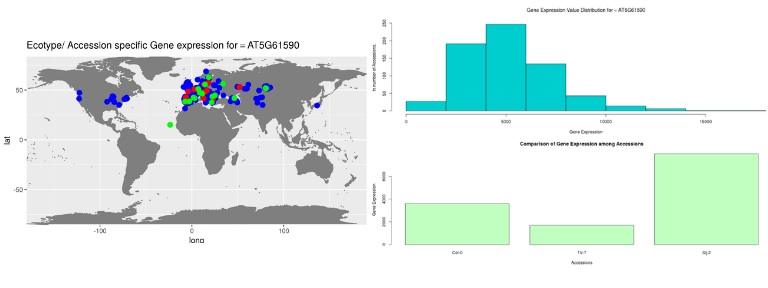

## EcoGEx : Ecotype-specific Gene Expression (R-📦 + 🕸️-App)

[](https://github.com/sk-sahu/EcoGEx/blob/master/LICENSE)
[](https://github.com/sk-sahu/EcoGEx/archive/master.zip)
[](https://github.com/sk-sahu/EcoGEx/)
[](https://sangram.shinyapps.io/EcoGEx)

First of all, **Why this package/app** when one can go over available set of large Excel files and dig out the information?
Because, recently I came across this tweet of Hadley Wickham, which insipred me to write my first full fledged code (Well, atleast in my mind!).

<blockquote class="twitter-tweet" data-conversation="none" data-lang="en"><p lang="en" dir="ltr">Automate everything that can be automated. I had to work hard to make it easier for others</p>&mdash; Hadley Wickham (@hadleywickham) <a href="https://twitter.com/hadleywickham/status/911992796441083906?ref_src=twsrc%5Etfw">September 24, 2017</a></blockquote>


And that also mentioned his phillospohy of package development in his book [Introduction to R-packages](http://r-pkgs.had.co.nz/intro.html)
> Anything that can be automated, should be automated.

I know this code in production is not perfect, but the idea of [MVP](https://en.wikipedia.org/wiki/Minimum_viable_product) can lead.

--------------
## Quick Start

**EcoGEx Web instance can be accessed here:** https://sangram.shinyapps.io/EcoGEx 

**If you want to use it Locally:**

Install through `install_github` fucntion from `devtools` package
```
library(devtools)
install_github("sk-sahu/EcoGEx")
```
To run EcoGEx instance locally:
```
library(EcoGEx)
runEcoGEx()
```
**Though the app is running properly**, I tried to R CMD check but [](https://travis-ci.org/sk-sahu/EcoGEx) So if any can help on this matter will be appreciated.

--------
## About

**Arabidopsis EcoGEx** helps to find Expression of a Gene across different ecotypes of Arabidopsis and the geographical locations information.

By simply using AGI (Arabidopsis Gene Identifier) ID you can look at their Expression pattern and Compare.



--------------
#### Contact:
[Sangram Keshari Sahu](https://sksahu.net) and Prince Saini

For any query please email on: sangramk@iisermohali.ac.in

Also you can arise a issue here or ask for a pull request.

---------------
#### ChangeLog:
Last update:
(7/12/2018)
* v0.6.7 : Download options for graphs and table added.
